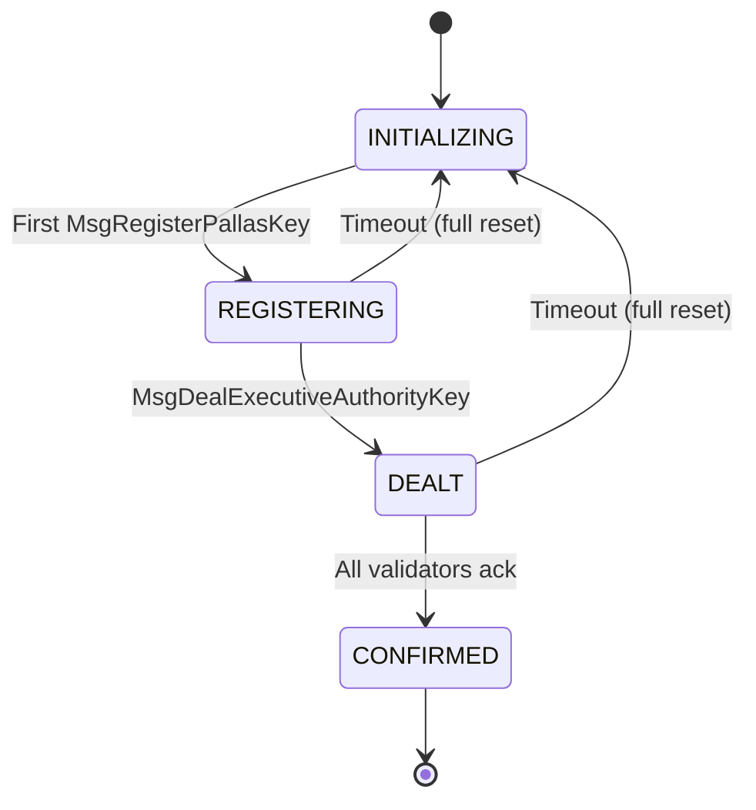

# Ceremony State Machine Refactor

## New State Machine



Key behavioral changes:

- **INITIALIZING** replaces the current "nil state" / ABORTED. It is the starting state and the reset target.
- Timeout now applies to **both** REGISTERING and DEALT (currently only DEALT).
- On timeout in either REGISTERING or DEALT, the ceremony performs a **full reset** to INITIALIZING (all fields cleared). There is no partial-ack confirmation -- all validators must ack explicitly.
- **CONFIRMED** is reached only when every registered validator has submitted `MsgAckExecutiveAuthorityKey`. Timeout never produces CONFIRMED.
- ABORTED is removed entirely.
- After CONFIRMED, no reset mechanism exists.

## Proto Changes

**[sdk/proto/zvote/v1/types.proto](sdk/proto/zvote/v1/types.proto)**

Renumber the enum (no backwards compat concerns) and rename timeout fields:

```protobuf
enum CeremonyStatus {
  CEREMONY_STATUS_UNSPECIFIED   = 0;
  CEREMONY_STATUS_INITIALIZING  = 1; // Waiting for first validator registration
  CEREMONY_STATUS_REGISTERING   = 2; // Accepting validator pk_i registrations
  CEREMONY_STATUS_DEALT         = 3; // DealerTx landed, awaiting acks
  CEREMONY_STATUS_CONFIRMED     = 4; // All validators acked, ea_pk ready
}
```

Rename `deal_time` and `ack_timeout` to be phase-generic since timeout now applies to both REGISTERING and DEALT:

```protobuf
message CeremonyState {
  ...
  uint64 phase_start   = 7;  // Unix seconds when current phase started
  uint64 phase_timeout = 8;  // Timeout in seconds for current phase
}
```

Regenerate with `cd sdk/proto && buf generate`.

## Constants

**[sdk/x/vote/types/keys.go](sdk/x/vote/types/keys.go)**

- Rename `DefaultAckTimeout` to `DefaultDealTimeout` (keep value 30)
- Add `DefaultRegistrationTimeout uint64 = 120` (2 minutes for validators to register; adjustable)

## Handler Changes

**[sdk/x/vote/keeper/msg_server_ceremony.go](sdk/x/vote/keeper/msg_server_ceremony.go)**

- `RegisterPallasKey`: Accept when `state == nil || state.Status == INITIALIZING` (instead of only nil). On first registration in a fresh/reset ceremony, transition to REGISTERING, set `PhaseStart = block_time`, `PhaseTimeout = DefaultRegistrationTimeout`.
- `DealExecutiveAuthorityKey`: Update status check from `REGISTERING` (old enum value) to new `REGISTERING`. On transition to DEALT, update `PhaseStart = block_time`, `PhaseTimeout = DefaultDealTimeout`.
- `AckExecutiveAuthorityKey`: Update status check to new `DEALT` enum value.

## EndBlocker Changes

**[sdk/x/vote/module.go](sdk/x/vote/module.go)** -- Section 3 (ceremony timeout)

Replace the current DEALT-only timeout logic with a unified check for both REGISTERING and DEALT. On timeout in either state, perform a full reset to INITIALIZING:

```go
if ceremony != nil && (ceremony.Status == REGISTERING || ceremony.Status == DEALT) {
    deadline := ceremony.PhaseStart + ceremony.PhaseTimeout
    if blockTime >= deadline {
        oldStatus := ceremony.Status
        // Any timeout = full reset. CONFIRMED only via all-ack.
        *ceremony = CeremonyState{Status: INITIALIZING}
        SetCeremonyState(...)
        emit event (oldStatus -> INITIALIZING)
    }
}
```

## Gate Check

**[sdk/x/vote/keeper/msg_server.go](sdk/x/vote/keeper/msg_server.go)** -- `CreateVotingSession`: Update the `CONFIRMED` status check to use the new enum value.

## Downstream References (9 files total)

All files referencing old enum values or field names need updating:

- `msg_server_ceremony.go` -- handler logic (8 refs)
- `module.go` -- EndBlocker (4 refs)
- `msg_server.go` -- ceremony gate (1 ref)
- `keeper_ceremony_test.go` -- 27 refs (CRUD tests, handler tests, integration test)
- `module_test.go` -- 13 refs (EndBlocker timeout tests, signer tests)
- `msg_server_test.go` -- 4 refs (seedConfirmedCeremony, ceremony gate tests)
- `query_server_test.go` -- 1 ref
- `testutil/app.go` -- 1 ref
- `types/keys.go` -- constant rename

## README Update

**[sdk/README.md](sdk/README.md)** -- Update the state transition diagram and table to reflect the new loop.

## Test Additions/Changes

- **EndBlocker**: Add REGISTERING timeout test (timeout in REGISTERING -> resets to INITIALIZING). Update existing DEALT timeout tests (any timeout -> INITIALIZING, remove partial-ack-to-CONFIRMED case).
- **RegisterPallasKey**: Add test that registration works after a reset (INITIALIZING state with prior history).
- **Integration test**: Update `TestFullCeremonyWithECIES` enum references.

